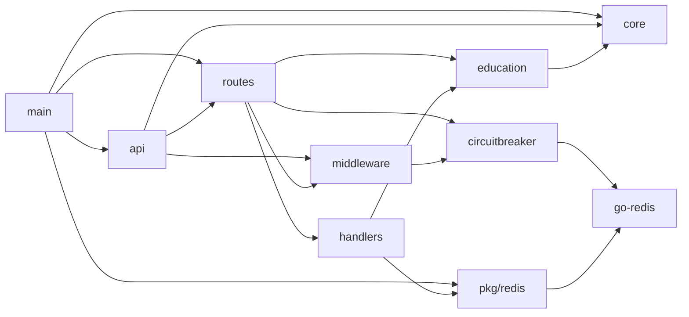

# Architecture

## Package Structure
- `main.go`
- `api/app.go`
- `api/routes/*.go`
- `api/handlers/*.go`
- `api/middleware/middleware.go`
- `pkg/core/*.go`
- `pkg/education/*.go`
- `pkg/circuitbreaker/*.go`
- `pkg/redis/*.go`
- `pkg/choice/choice.go`

## Dependency Relationships

## Interfaces and Abstractions
- `pkg/education/service.go`
  - `type EducationService interface { Submit(ctx context.Context, req Request) (Response, error) }`
  - `type HTTPTransport interface { Do(req *http.Request) (*http.Response, error) }`
- `pkg/core/otel.go`
  - `type OtelService interface { SpanFromContext; LoggerProvider; Shutdown }`
- `pkg/circuitbreaker/circuitbreaker.go`
  - `type Breaker interface { Allow; OnSuccess; OnFailure }`

These abstractions support unit testing and integration boundary replacement without route-layer rewrites.

## Concurrency Model
- Server lifecycle:
  - `runServer` starts `app.Listen` in a goroutine and selects on server error or signal context cancellation.
  - graceful shutdown uses `app.ShutdownWithTimeout(5 * time.Second)`.
- Request lifecycle:
  - handlers create per-request contexts with timeout (`/status`: 2s, `/api/edu`: 5s).
- Circuit-breaker middleware:
  - breaker registry map guarded with `sync.RWMutex`.
  - lazy breaker initialization via double-check lock pattern.

## Error Handling Strategy
- Global Fiber error handler (`api/errorHandler`) converts errors into HTTP status and message.
- `fiber.NewError` used for explicit gateway semantics in education handler.
- Wrapped errors with context (`fmt.Errorf("...: %w", err)`) in service layers.
- Circuit breaker denies with `503 Service Unavailable` on open or state-read failure.
- Panic recovery middleware logs stack traces (`recover.Config{EnableStackTrace:true}`).

## Middleware Stack
Ordered middleware in `api.New`:
1. Recover
2. CORS (`*` origin/headers/methods)
3. OpenTelemetry Fiber middleware
4. Structured request logging (trace/span/request IDs)
5. Conditional Cognito auth middleware

## Dependency Injection Pattern
Observed constructor and options-based DI:
- `education.New(cfg, education.Options{HTTPClient, Logger, Timeout})`
- `api.New(&api.Config{Core, Logger, Otel, Redis})`
- Circuit breaker injection via higher-order middleware factory:
  - `WithCircuitBreaker(func(name string) *RedisBreaker { ... })`

## Technical Caveats (Current State)
- `/api/edu` handler builds a hardcoded request payload instead of binding user input.
- `main.runServer` currently binds literal `":8000"` despite config port being loaded.
- `.env.example` key casing does not match `NewConfigFromEnv` key names.
- Some tests require local Redis and fail when unavailable.

## Assumptions
- **High confidence:** Current layering is intentionally thin and integration-oriented rather than strict clean-architecture separation.
- **Medium confidence:** Additional provider adapters are expected to follow existing interface patterns in `pkg/education` and middleware wrappers.
