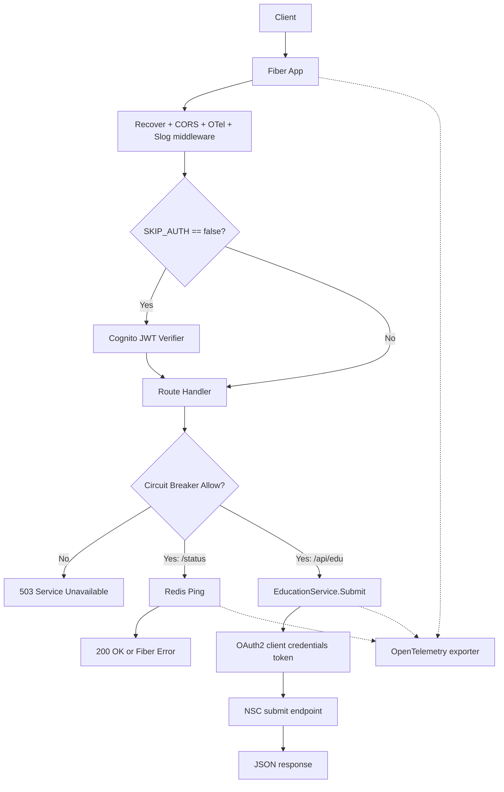

# Verification Service API Overview

## Purpose
The Verification Service API provides a unified HTTP interface for eligibility verification workflows, currently focused on education verification through NSC (National Student Clearinghouse) integration and system health verification through Redis-backed checks.

This service evolved from consent-based verification work and is intended to reduce manual burden during benefits eligibility evaluation.

## System Context
Runtime dependencies in current implementation:
- Fiber (`github.com/gofiber/fiber/v2`) for HTTP server and routing.
- Redis (`github.com/redis/go-redis/v9`) for health checks and distributed circuit-breaker state.
- NSC endpoints (`NSC_TOKEN_URL`, `NSC_SUBMIT_URL`) for education verification.
- AWS Cognito JWKS/JWT validation for request authentication (when `SKIP_AUTH=false`).
- OpenTelemetry OTLP exporter for tracing/metrics/log fanout.

## Key Packages
- `main`: process bootstrap, env/config load, OTel startup, Redis client init, route registration, graceful shutdown.
- `api`: Fiber app construction and shared middleware setup.
- `api/routes`: endpoint registration (`/`, `/status`, `/api/edu`).
- `api/handlers`: HTTP handlers for Redis status and education verification.
- `api/middleware`: Cognito auth and circuit-breaker middleware.
- `pkg/core`: configuration, logger, OTel service abstractions/utilities.
- `pkg/education`: NSC service abstraction and HTTP/OAuth submit flow.
- `pkg/circuitbreaker`: Redis-backed circuit-breaker implementation.
- `pkg/redis`: Redis client factory and health ping.

## Design Principles (Observed)
- Explicit startup configuration from environment via `core.NewConfigFromEnv()`.
- Interface-driven boundaries for integration points (`EducationService`, `HTTPTransport`, `OtelService`, `Breaker`).
- Middleware-first cross-cutting concerns (recovery, CORS, tracing, request logging, auth, circuit breaking).
- Operational defaults favoring availability in unknown breaker state (`FailOpen=true` by default).

## High-Level Request Flow

Current wiring caveat on `main`: `/status` is registered in `api.New` using `api.Config.Redis`, but `main` currently builds `api.Config` without a Redis client. Treat the `/status` flow above as intended behavior pending that wiring fix.

## Documentation Map
- [Architecture](architecture.md)
- [Setup](setup.md)
- [API](api.md)
- [Features](features/)
- [Research](research/)
- [Planning](planning/)
- [Questions](questions/)

## Naming Note
Initial requirements referenced `/docs/planing`; this repo standardizes on `/docs/planning`.

## Assumptions
- **High confidence:** Redis is the only persistent/shared runtime store currently used by this service.
- **Medium confidence:** `/api/edu` is presently a scaffold/test endpoint and not yet a finalized external product contract.
- **Medium confidence:** Additional verification domains (beyond education) are expected in future iterations based on project intent, but are not yet implemented.
